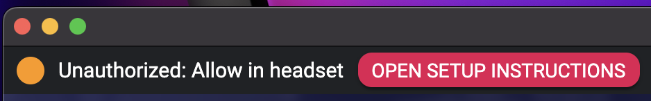
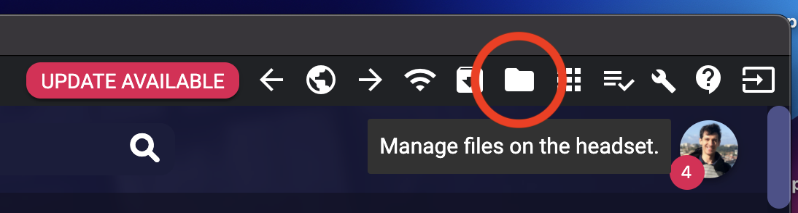
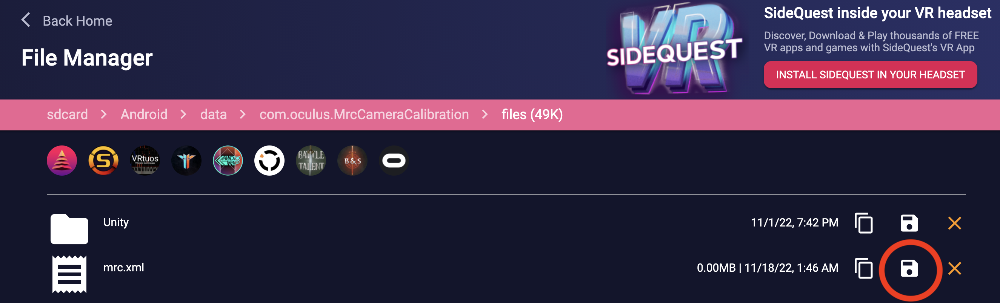

## Additional Instructions

Mixed Reality Capture is broken on the Quest 2/Pro after version 51 was released. You'll need to use Developer mode and [SideQuest](https://sidequestvr.com/setup-howto) to be able to copy the calibration file (`mrc.xml`) manually to the right place.

1. After completing the calibration, do not move your iPhone/iPad. Connect your Quest 2/Pro to your PC and follow the next steps.

1. Open SideQuest, authorize the connection in the headset, and click on the folder icon on the top right ("File Manager").

2. Navigate to `/sdcard/Android/data/com.oculus.MrcCameraCalibration/files` and copy the `mrc.xml` file to your computer (after completing the calibration).

3. Navigate to the `files` directory of the game you want to record and paste the `mrc.xml` file there.

For example, paste the `mrc.xml` file inside `/sdcard/Android/data/com.beatgames.beatsaber/files` for Beat Saber.

4. Disconnect the headset from your PC. Launch the game you want to record, and then start the Mixed Reality connection on Reality Mixer.

