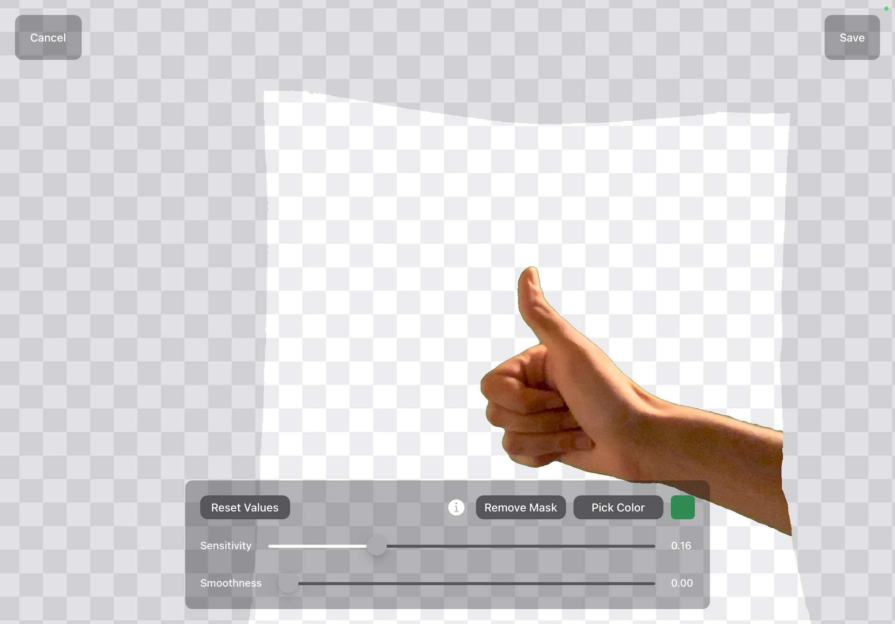
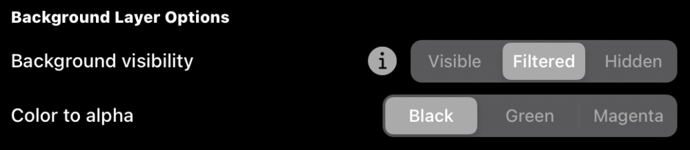
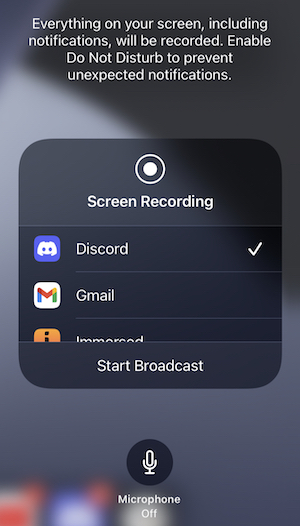

# Instructions

- [Requirements](#requirements)
- [YouTube Tutorials](#youtube-tutorials)
- [Calibration, what is this?](#calibration)
- [How to calibrate?](#calibration-howto)
- [How to start the mixed reality capture?](#mixedreality-howto)
- [Mixed Reality modes](#modes)
   - [Virtual Green Screen](#virtual-green-screen)
   - [Avatar](#avatar)
   - [Green Screen](#green-screen)
   - [Spectator](#spectator)
- [Advanced options](#advanced)
   - ["Augmented Reality" effect](#ar-effect)
   - [Moving the camera around the scene](#moving-camera)
- [How to record a video?](#recording-howto)
- [How to live stream?](#livestream-howto)
- [How to improve performance?](#performance-howto)

# Requirements 

- Oculus Quest 1 or 2 with the [Oculus MRC Calibration app](https://www.oculus.com/experiences/quest/2532132800176262/) version 1.7 installed.
- **Virtual Green Screen and Avatars**: iPhone or iPad with an A12 chip or newer, running iOS 14. The LiDAR sensor is optional but recommended for better results.
- **Green Screen and Spectator**: iPhone or iPad runnning iOS 14.
- 5 Ghz WiFi network (802.11ac).
- A [compatible Quest VR application/game](Compatibility.md).
 
 
 
 # YouTube Tutorials 

 * Fabio [Tutorial: Mixed Reality with an iPhone and an Oculus Quest (no green screen)](https://www.youtube.com/watch?v=iRLwhK1Oees)

 * Disco-VR [Mixed Reality on iPhone without Green Screen! Tutorial for Beat Saber using Oculus Quest 2](https://www.youtube.com/watch?v=NH5xAwQ9UY4)

# Calibration, what is this? 

This is the process to indicate to the Oculus Quest the iPhone/iPad camera's position and orientation inside the virtual world. You'll need to calibrate whenever you move your iPhone/iPad and whenever you reset/redefine your Guardian boundary. 

You might also need to calibrate again after you install a new VR application/game that supports mixed reality, or else the Reality Mixer app won't be able to connect to that new application/game.

# How to calibrate? 

- Start the app, and tap on "Start Calibration".

- Launch the ["Mixed Reality Capture"](https://www.oculus.com/experiences/quest/2532132800176262/) app on the Quest.

- Make sure that your iPhone/iPad and the Quest are both connected to the same WiFi network and fill in the Quest's IP address. This IP address should be displayed by the "Mixed Reality Capture" app, however, if it shows "127.0.0.1", then you'll need to open the Quest's WiFi settings to find the correct IP address.

- Select your resolution scale factor. A smaller factor will result in faster performance when running VR applications/games in mixed reality.

- Position your iPhone/iPad. You won't be able to move it after this, or else you'll need to recalibrate. Use a tripod, if possible.

- Tap on "Connect". You might be asked to give the app permission to access your local network and your camera, you should allow both.

- Take your headset and the right controller.

- Now, put your headset on and walk in front of the camera, bring your right controller's trigger button as close as possible to the camera, touch the tip of the right controller on the camera, and then press the right controller's trigger button or the "A" button.

- Take a few steps back, while still facing the camera, and press the right controller's trigger button or the "A" button a second time.

- Now, put your headset aside and look at the iPhone/iPad screen. You should now see a photo of you and a blue circle. Move the blue circle to where the right controller is on the photo. You'll see an overlay image indicating the controller and the headset, try to make this image match the photo. Don't worry if you can't get them to align perfectly, the mixed reality capture should still look good. Tap on "Done" to continue.

- You can now take both the controllers and put your headset on again, if you wish to verify your calibration. However, you'll need a second person looking at the screen to be able to confirm it. You'll notice some delay between your movements and the overlay image, that's normal and don't worry, the mixed reality recording will look more responsive. Tap on "Save to Headset" on the top right if you wish to save this calibration.

- Remember, you should not move your iPhone/iPad during or after the calibration, or else you'll need to calibrate again.

- You should now **quit** the Mixed Reality Capture app on the Quest.

# How to start the mixed reality capture? 

 - On the main menu, select "Start Mixed Reality".
 
 

 - First, make sure that you've completed the calibration and that you haven't moved your iPhone/iPad. Also make sure that your iPhone/iPad and the Quest are still connected to the same WiFi network.
 
 - Fill in the Quest's IP address.

 - Tap on "Show Options" to reveal the extra options and then select the desired mode. Some modes might require some extra configuration before you can start the mixed reality connection, check the [modes](#modes) section below for more information.
 
 
 
 - Some games, such as The Thrill of the Fight, use the color magenta for transparency. Make sure to use the "use magenta for transparency" option under "foreground layer options" if you're playing games like this.

 - Some other games, such as Beat Saber, might require you to enable Mixed Reality capture on their Settings. You'll have to do that first before starting the connection.
 
 - Make sure the Oculus Mixed Reality Capture app is **NOT** running, then launch your compatible application/game on the Quest.
 
 - Tap on "Connect". You might be asked to give the app permission to access your local network and your camera, you should allow both.
 
 - You should now see a blank screen. Put your headset on again and start playing, the screen will update and it'll display your gameplay in mixed reality.
 
 
 
 - Tap on the screen to display the other options, and tap on "Disconnect" on the top left when you're finished.
 
 
 
 - You can now close your application/game on the Quest.
 
 If the camera position appeared to be incorrect or you were having other issues. Try restarting your headset, defining a new Guardian boundary and calibrating again.

# Mixed Reality modes 

## Virtual Green Screen 

This mode uses ARKit's "person segmentation" to extract your body from the video without using a green screen. It works best if the camera is pointed to a wall in a well-lit environment, and if you're the only thing between the camera and the wall.

This mode is only available on devices with an A12 chip or newer. 

## Avatar 

This mode uses ARKit's Body Tracking to capture your movement and animate an avatar. It works best if your entire body is within frame (including your feet) and if you're facing the back camera, the avatar might not appear or animate properly otherwise. 

**Examples**: [Beat Saber, Open Brush, Cubism](https://www.youtube.com/watch?v=iTsDkg4hbro), [Synth Riders](https://www.youtube.com/watch?v=fOPpnZKSK4I).

 - You must choose an avatar before you can start the mixed reality connection.
 
 

This mode is only available on devices with an A12 chip or newer. 

## Green Screen 

Use this mode if you have a regular green screen. You'll need to follow the steps below to configure your green screen before you can start the mixed reality connection. 

**Examples**: [Beat Saber](https://twitter.com/fabio914/status/1412241599426449408), [Synth Riders](https://www.youtube.com/watch?v=ov5VCmVuMGo). 

* Place your green screen behind the camera, select the green screen mode, and tap on "Configure Chroma Key". Do not move your device during this process if you've already completed the calibration, or else you'll need to recalibrate.

* Tap on "pick color" to display the color selector and then tap on the eye dropper icon .

* Move the circle to your green screen to pick its color, and then close the color selector.

 * Adjust the "sensitivity" so that your green screen (and only the green screen) becomes transparent. We recommend using values between 0.1 and 0.2.
 

 * Tap on "add mask" if you wish to hide everything outside of your green screen. We don't recommend using the [moving camera option](#moving-camera) or the autofocus option if you choose to add a mask.

 * Move in front of the camera to double check the configuration, and adjust the "smoothness" if you notice a green border around you. We recommend using very small values (e.g. 0.01) or keeping it at zero.
 

 
 * Tap on "save" if everything looks good and then start the mixed reality connection if you've already completed the calibration. Remember, you should not wear anything green, and you should keep the camera and the green screen perfectly still if you've added a mask. 
 
 
 
## Spectator 

This mode only displays the raw output from the Oculus Quest, without any extra composition. You won't be able to see the output from the camera unless you hide or filter the background layer. 

**Example**: [Beat Saber](https://www.youtube.com/watch?v=inp_TRWU5QM).

# Advanced options 

## "Augmented Reality" effect 

Some games and apps allow you to customize the color of their environment, you can use this to make the background disappear and achieve an "augmented reality" effect. 

 - To achieve this effect, change the "background visibility" to "filtered" and select the appropriate "color to alpha".

 - Alternatively, you can change the "background visibility" to "hidden", however, if do so, you'll only be able to see the virtual objects between yourself and the camera.

**Examples**

| Game/App | Video | Instructions |
|--------------|--------|---------------|
| Beat Saber | [YouTube](https://www.youtube.com/watch?v=jWCI-Ha1IJU) | Pick the color black as the color of both light sources. Increase the color saturation of the red and blue blocks. Turn on static lights, turn off the note spawning effect and all other effects, and reduce the trail intensity to zero. Set the "background visibility" to "filtered" and "color to alpha" to "black" on Reality Mixer. |
| Cubism | [YouTube](https://www.youtube.com/watch?v=EXDu0yhvCaI) | Folow [these instructions](https://github.com/cubismvr/Mods/tree/main/CustomTheme#using-custom-themes-on-quest-for-faux-ar-mixed-reality-using-reality-mixer). |
| Gravity Sketch | [YouTube](https://www.youtube.com/watch?v=-qPdet8VncU) | Use the "black room" preset. Set the "background visibility" to "filtered" and "color to alpha" to "black" on Reality Mixer. |
| Open Brush | [YouTube](https://www.youtube.com/watch?v=-qPdet8VncU) | Choose the black environment and paint with bright colors. Set the "background visibility" to "filtered" and "color to alpha" to "black" on Reality Mixer. |
| Space Slurpies | [YouTube](https://www.youtube.com/watch?v=2amt8r5QSGk) | Select the "Mixie Mix-Up" level from the "VR Friends" map pack. Set the "background visibility" to "filtered" and "color to alpha" to "green" on Reality Mixer. |

## Moving the camera around the scene 

The "Moving Camera" option allows you to move the camera around the Mixed Reality scene. 

**Examples**: [Beat Saber](https://www.youtube.com/watch?v=siIjiD2NH4M), [Cubism](https://www.youtube.com/watch?v=ZPduz_zqOkc), [Open Brush](https://www.youtube.com/watch?v=_FSoRw4pILk), [Peco Peco](https://www.youtube.com/watch?v=WLcJx2A647Y).

* Complete the calibration as normal, and keep the device still. Tap on "Start Mixed Reality", "Show Options" and then "Enable Moving Camera" before starting your mixed reality connection.

* You can only start moving the camera after you start the mixed reality connection. Keep in mind that you'll need to recalibrate if you move the device while not connected and after restarting the app.

* This option might not work with every game/app and we don't recommend using it with the green screen mode [if you added a mask](#mask).

# How to record a video? 

You can use the iPhone/iPad native "Screen Recording" feature.

- Open "Control Center" before starting your mixed reality capture

- Tap on the record button, that looks like this:

When you're finished, you can open "Control Center" and tap on the same button again to finish recording. You'll find your recording in the "Photos" app.

Follow the instructions below if you don't have the record option inside your "Control Center":

 - Open the iPhone/iPad Settings app, and navigate to "Control Center"
 

 
 - Scroll down to "More Controls" and tap on the "+" button beside "Screen Recording".
 

 

 
# How to live stream? 

**Example**: [Immersed and Zoom](https://www.youtube.com/watch?v=rhAepGvSMf4)

- First, make sure that you have the [record option](#record-option) inside your "Control Center".

- Before you start the mixed reality connection, open the "Control Center" and long press the record button, and you'll see a list of apps that support streaming.

- Choose an app that supports streaming to your favorite streaming service and then tap on "Start Broadcast". For example, you can use the app [Omlet Arcade](https://apps.apple.com/us/app/omlet-arcade-livestream-games/id1152185878) to live stream to YouTube or Twitch.

- You can now start the mixed reality connection.

# How to improve performance? 

 - Make sure that your device is using a 5 GHz WiFi connection (e.g. 802.11ac), that you don't have too many devices using the network at the same time while you're using the app, and that you have a strong signal.
 
 - Make sure that your device is not on Low Power mode. It is recommended that you keep your device connected to a power outlet while using the app.
 
 - Select a small resolution scale factor (`0.5x` or `0.25x`) and then calibrate again.
