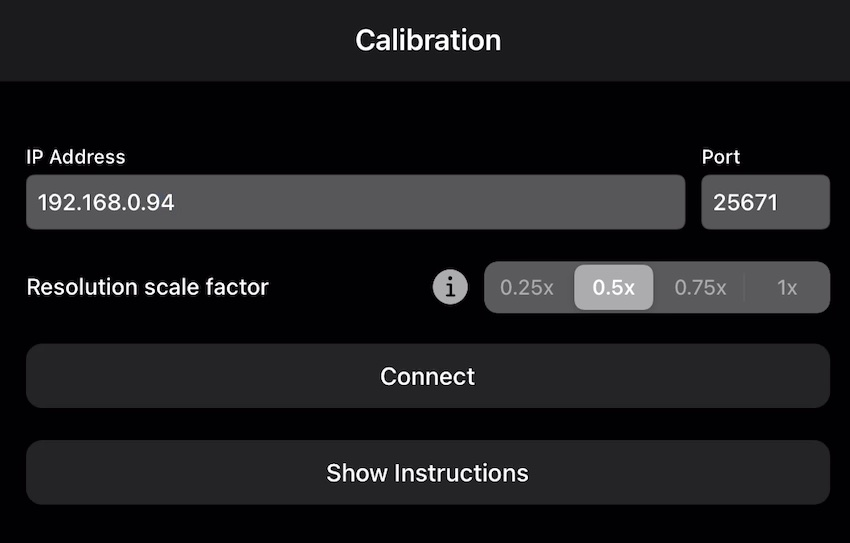

# Instructions

## Requirements

 - Oculus Quest 1 or 2 with the [Oculus MRC Calibration app](https://www.oculus.com/experiences/quest/2532132800176262/) version 1.7 installed. This application is only necessary for the calibration step.
 - iPhone or iPad with an A12 chip or newer, running iOS 14. The LiDAR sensor is optional but recommended for better results.
 - 5 Ghz WiFi network (802.11ac).
 - A [compatible Quest VR application/game](Compatibility.md).
 
## Calibration, what is this?

This is the process to indicate to the Oculus Quest the iPhone/iPad camera's position and orientation inside the virtual world. You'll need to calibrate whenever you move your iPhone/iPad and whenever you reset/redefine your Guardian boundary. 

You might also need to calibrate again after you install a new VR application/game that supports mixed reality, or else the Reality Mixer app won't be able to connect to that new application/game.

## How to calibrate?

- Start the app, and tap on "Start Calibration".

- Launch the "Mixed Reality Capture" app on the Quest.

- Make sure that your iPhone/iPad and the Quest are both connected to the same WiFi network and fill in the Quest's IP address. This IP address should be displayed by the "Mixed Reality Capture" app, however, if it shows "127.0.0.1", then you'll need to open the Quest's WiFi settings to find the correct IP address.

- Select your resolution scale factor. A smaller factor will result in faster performance when running VR applications/games in mixed reality.

- Position your iPhone/iPad. You won't be able to move it after this, or else you'll need to recalibrate. Using a tripod is recommended.

- Tap on "Connect". You might be asked to give the app permission to access your local network and your camera, you should allow both.

- Take your headset and the right controller.

- Now, put your headset on and walk in front of the camera, then bring your right controller's trigger button as close as possible to the camera and press the right controller's trigger button or the "A" button.

- Take a few steps back, while still facing the camera, and press the right controller's trigger button or the "A" button a second time.

- Now, put your headset aside and look at the iPhone/iPad screen. You should now see a photo of you and a blue circle. Move the blue circle to where the right controller is on the photo. You'll see an overlay image indicating the controller and the headset, try to make this image match the photo. Don't worry if you can't get them to align perfectly, the mixed reality capture should still look good. Tap on "Done" to continue.

- You can now take both the controllers and put your headset on again, if you wish to verify your calibration. However, you'll need a second person looking at the screen to be able to confirm it. You'll notice some delay between your movements and the overlay image, that's normal and don't worry, the mixed reality recording will look more responsive. Tap on "Save to Headset" on the top right if you wish to save this calibration.

- Remember, you should not move your iPhone/iPad during or after the calibration, or else you'll need to calibrate again.

- You should now **quit** the Mixed Reality Capture app on the Quest.

## How to start the mixed reality capture?

 - On the main menu, select "Start Mixed Reality".
 
 

 - First, make sure that you've completed the calibration and that you haven't moved your iPhone/iPad. Also make sure that your iPhone/iPad and the Quest are still connected to the same WiFi network.
 
 - Fill in the Quest's IP address.

 - Some games, such as The Thrill of the Fight, use the color magenta for transparency. Make sure to use this option if you're playing games like this.

 - Some other games, such as Beat Saber, might require you to enable Mixed Reality capture on their Settings. You'll have to do that first before starting the connection.
 
 - Make sure the Oculus Mixed Reality Capture app is **NOT** running, then launch your compatible application/game on the Quest.
 
 - Tap on "Connect". You might be asked to give the app permission to access your local network and your camera, you should allow both.
 
 - You should now see a blank screen. Put your headset on again and start playing, the screen will update and it'll display your gameplay in mixed reality.
 
 
 
 - Tap on the screen to display the other options, and tap on "Disconnect" on the top left when you're finished.
 
 
 
 - You can now close your application/game on the Quest.
 
 If the camera position appeared to be incorrect or you were having other issues. Try restarting your headset, defining a new Guardian boundary and calibrating again.

## How to record a video?

You can use the iPhone/iPad native "Screen Recording" feature.

- Open "Control Center" before starting your mixed reality capture

- Tap on the record button, that looks like this:

When you're finished, you can open "Control Center" and tap on the same button again to finish recording. You'll find your recording in the "Photos" app.

Follow the instructions below if you don't have the record option inside your "Control Center":

 - Open the iPhone/iPad Settings app, and navigate to "Control Center"
 
 
 
 - Scroll down to "More Controls" and tap on the "+" button beside "Screen Recording".
 
 

## How to improve performance?

 - Make sure that your device is using a 5 GHz WiFi connection (e.g. 802.11ac), that you don't have too many devices using the network at the same time while you're using the app, and that you have a strong signal.
 
 - Make sure that your device is not on Low Power mode. It is recommended that you keep your device connected to a power outlet while using the app.
 
 - Select a small resolution scale factor (`0.5x` or `0.25x`) and then calibrate again.
