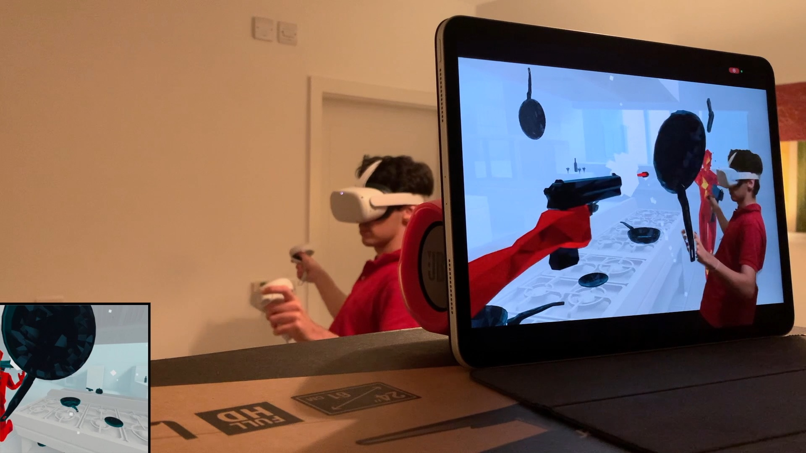
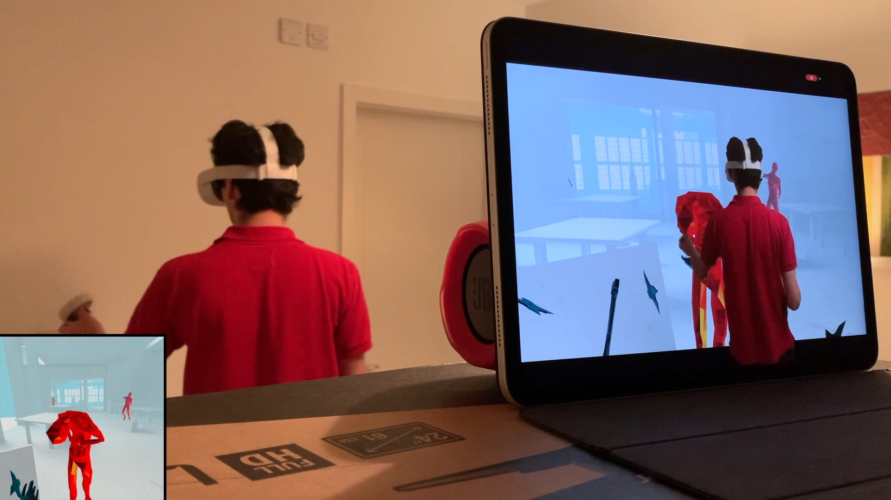
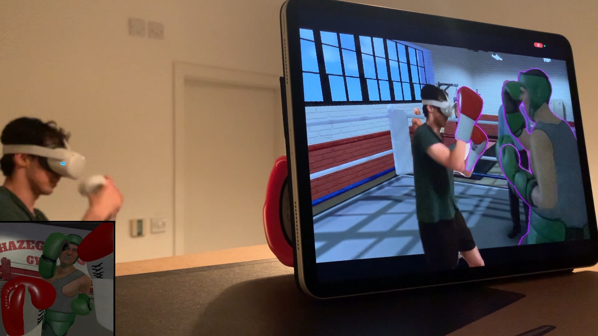
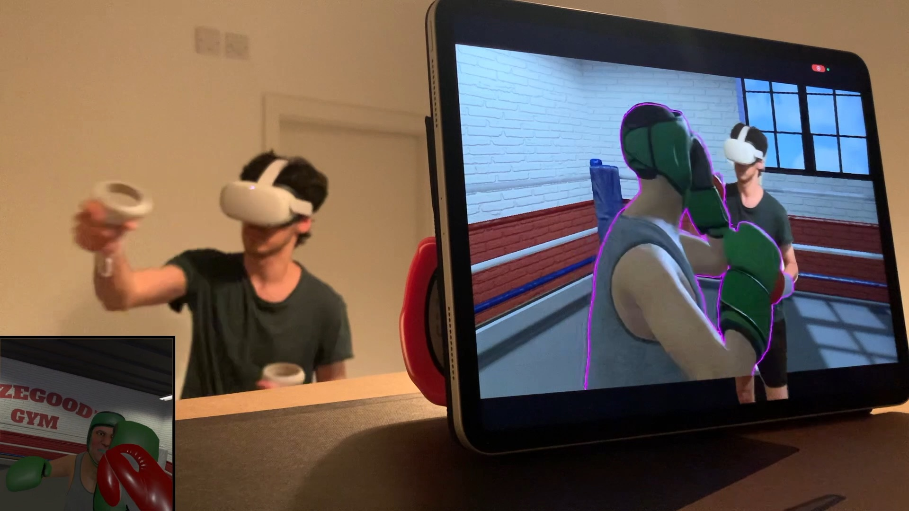
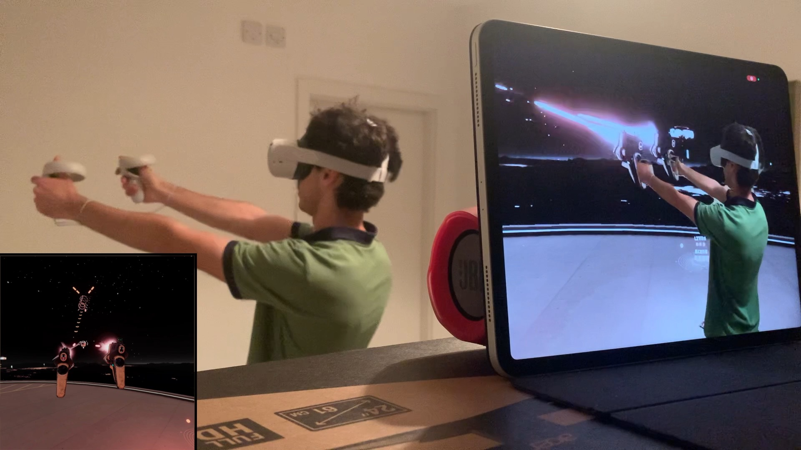
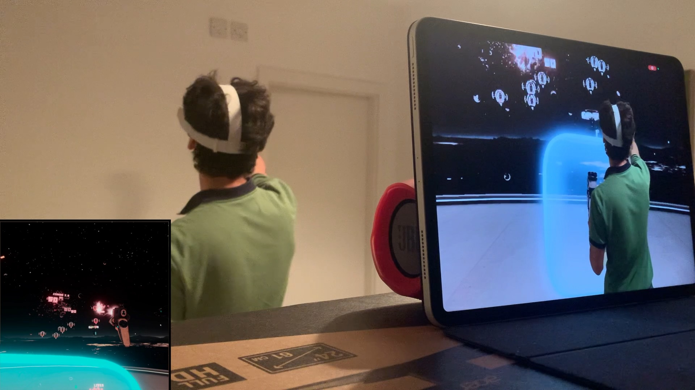

# Reality Mixer <br/> *Mixed Reality app for iOS*

Reality Mixer lets you use your iPhone or iPad to capture your favorite VR games and applications in Mixed Reality without a PC and without a green screen.

Click on [this link](https://apps.apple.com/us/app/reality-mixer/id1539307552) to get it from the App Store, or follow the [instructions](#installation) below to install it using alternative methods.

Follow us on [Twitter](https://twitter.com/reality_mixer) for more updates!

## Examples

| Game | YouTube video | Photos |
|------|---------------|--------|
| Beat Saber | [Link](https://www.youtube.com/watch?v=JL5e_moZ7XM) |   |
| SUPERHOT | [Link](https://youtu.be/ZnOY8juMw4k) |   |
| The Thrill of the Fight | [Link](https://youtu.be/aPSBmej4ppc) |   |
| Space Pirate Trainer | [Link](https://youtu.be/44Nmv7Es5yI) |   |

## Requirements

 - Oculus Quest 1 or 2 with the [Oculus MRC Calibration app](https://www.oculus.com/experiences/quest/2532132800176262/) version 1.7 installed.
 - iPhone or iPad with an A12 chip or newer, running iOS 14. The LiDAR sensor is optional but recommended for better results.
 - 5 Ghz WiFi network (802.11ac).
 - A [compatible Quest VR application/game](Compatibility.md).

## Compatible Applications/Games

The app is currently only compatible with the Oculus Quest 1 and 2, check this [link](Compatibility.md) for a list of the compatible games/applications.

## Installation

### App Store

[Link](https://apps.apple.com/us/app/reality-mixer/id1539307552)

### AltStore

 - Follow [these instructions](https://altstore.io/) to install and configure AltServer on your PC or Mac, then install the AltStore app on your iPhone/iPad.
 
 - Open the camera app on your iPhone/iPad and scan this QR code:


OR

- Open this URL on your iPhone/iPad:

```
altstore://install?url=https://github.com/fabio914/RealityMixer/releases/download/0.2.1/RealityMixer.ipa
```

### TestFlight

Use [this link](https://testflight.apple.com/join/gyXe6zXG) to join the beta. Limited to the first 10 thousand users.

### Xcode

To build the app using your own developer account, create a `DeveloperSettings.xcconfig` config file inside `RealityMixer/` with your development team identifier and your organization identifier:

```
DEVELOPMENT_TEAM = YOUR_TEAM_ID
ORGANIZATION_IDENTIFIER = com.yourcompany
```

## Instructions

[Link](Instructions.md)

## TO-DOs

 - [ ] Investigate the audio delay;

 - [ ] Improve the calibration screen and fix the positioning of the controller models;
 
 - [ ] Add a "green screen mode" that will allow the user to use the app with a regular green screen, allowing the app to run on devices without an A12 chip;
 
## Wishlist

These are features that could be implemented in the future:

 - Create a custom calibration app for the Quest to replace the Oculus MRC app, allowing the user to calibrate from VR itself;

 - Use ARKit's body tracking to replace the image from the camera with an avatar;
 
 - Allow the user to adjust the FOV of the mixed reality capture;
 
 - Allow the app to cast the video output (although this should already be possible if you long press the "Screen recording" button on "Control Center" and then select a streaming app);
 
 - Android version;

## Credits

This project is based on the [Oculus MRC plugin for OBS](https://github.com/facebookincubator/obs-plugins/tree/master/oculus-mrc).

It uses [SwiftSocket](https://github.com/swiftsocket/SwiftSocket) to handle the TCP connection with the Oculus Quest, FFMPEG with Apple's VideoToolbox to decode the stream, and ARKit for the "virtual green screen". 

The right and left controller models are modified versions of the `oculus-touch-v3` models from the [WebXR Input Profiles](https://github.com/immersive-web/webxr-input-profiles).
