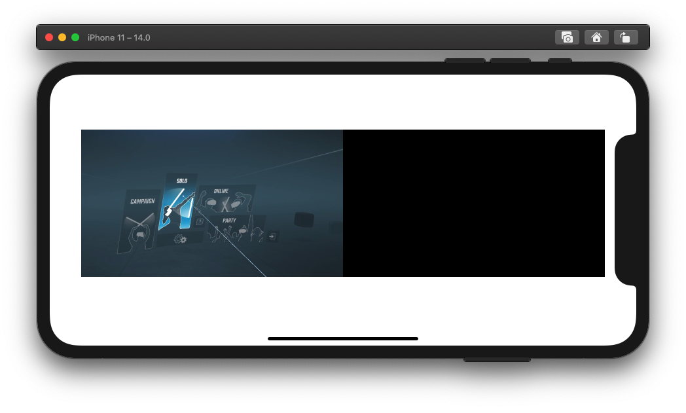
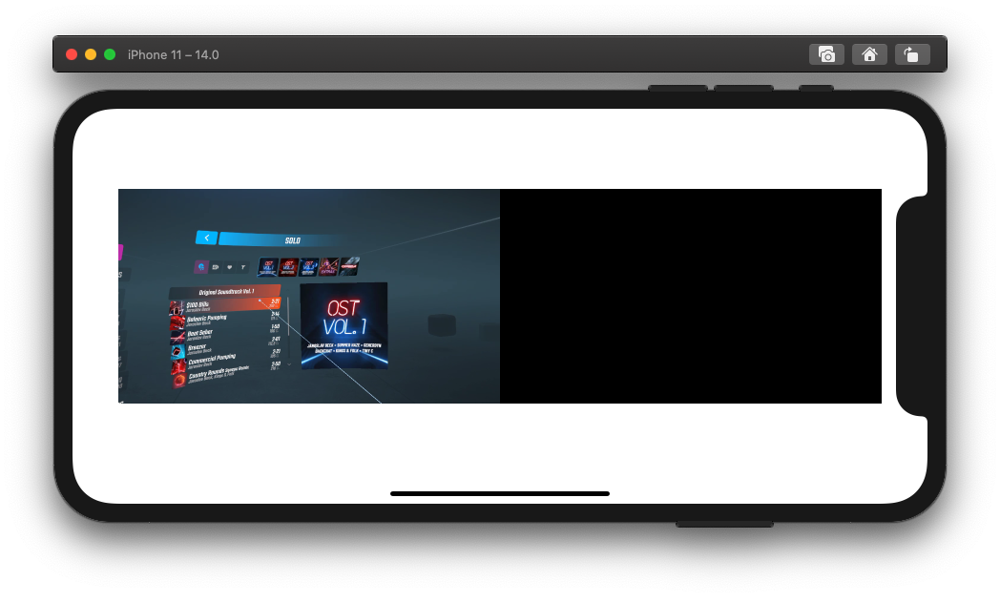

# Oculus Quest Mixed Reality For iOS

This is a standalone Oculus Quest Mixed Reality app for iOS that doesn't require a PC for generating Mixed Reality content.

This project is based on the [Oculus MRC plugin for OBS](https://github.com/facebookincubator/obs-plugins/tree/master/oculus-mrc), it uses [SwiftSocket](https://github.com/swiftsocket/SwiftSocket) to handle the TCP connection with the Oculus Quest, and FFMPEG with Apple's VideoToolbox to decode the stream. It also requires [Carthage](https://github.com/Carthage/Carthage).

This is still a work in progress and it's been tested on the Oculus Quest 2 with Beat Saber.

