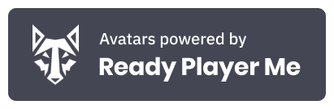

# Reality Mixer <br/> *Mixed Reality app for iOS*

Reality Mixer lets you use your iPhone or iPad to capture your favorite VR games and applications in Mixed Reality without a PC and without a green screen.

Click on [this link](https://apps.apple.com/us/app/reality-mixer/id1539307552) to get it from the App Store, or follow the [instructions](#installation) below to install it using alternative methods.

Follow us on [Twitter](https://twitter.com/reality_mixer) for more updates!

<a href="https://www.youtube.com/watch?v=KhoyKABFvzA"></a>

## Features

 - Mixed Reality capture without green screen (using ARKit's person segmentation).
 - Avatars (using ARKit's body tracking) and Ready Player Me avatars. [Example](https://www.youtube.com/watch?v=fOPpnZKSK4I).
 - "AR" mode. [Example](https://www.youtube.com/watch?v=jWCI-Ha1IJU).
 - Moving camera. [Example](https://www.youtube.com/watch?v=_FSoRw4pILk).
 - Spectator camera. [Example](https://www.youtube.com/watch?v=inp_TRWU5QM).
 - Mixed Reality with green screen. [Example](https://twitter.com/fabio914/status/1409331072832266242).

## Examples

| Game | YouTube video | Photos |
|------|---------------|--------|
| Beat Saber | [Link](https://www.youtube.com/watch?v=JL5e_moZ7XM) |   |
| SUPERHOT | [Link](https://youtu.be/ZnOY8juMw4k) |   |
| The Thrill of the Fight | [Link](https://youtu.be/aPSBmej4ppc) |   |
| Space Pirate Trainer | [Link](https://youtu.be/44Nmv7Es5yI) |   |

## How to use it?

You can find instructions and tutorials [on this page](Instructions.md).

**ATTENTION!** Mixed Reality Capture is broken on the Quest 2/Pro after version 51 was released (that uses Android 12). You'll need to follow additional steps with [SideQuest](https://sidequestvr.com/). You can read these steps [here](Additional-instructions.md).

## Requirements

 - Oculus Quest 1 or 2, or the Meta Quest Pro, with the [Oculus MRC Calibration app](https://www.oculus.com/experiences/quest/2532132800176262/) version 1.7 installed.
 - **Virtual Green Screen and Avatars**: iPhone or iPad with an A12 chip or newer, running iOS 14. The LiDAR sensor is optional but recommended for better results.
 - **Green Screen and Spectator**: iPhone or iPad runnning iOS 14.
 - 5 Ghz WiFi network (802.11ac).
 - A [compatible Quest VR application/game](Compatibility.md).

## Compatible Applications/Games

The app is currently only compatible with the Oculus Quest 1 and 2, and the Meta Quest Pro, check this [link](Compatibility.md) for a list of the compatible games/applications.

## Installation

### App Store

[Link](https://apps.apple.com/us/app/reality-mixer/id1539307552)

### AltStore

 - Follow [these instructions](https://altstore.io/) to install and configure AltServer on your PC or Mac, then install the AltStore app on your iPhone/iPad.
 
 - Open the camera app on your iPhone/iPad and scan this QR code:


**OR**

- Open this URL on your iPhone/iPad: 

`altstore://install?url=https://github.com/fabio914/RealityMixer/releases/download/0.6.0/RealityMixer.ipa`

### Xcode

To build the app using your own developer account, create a `DeveloperSettings.xcconfig` config file inside `RealityMixer/` with your development team identifier and your organization identifier:

```
DEVELOPMENT_TEAM = YOUR_TEAM_ID
ORGANIZATION_IDENTIFIER = com.yourcompany
```

## TO-DOs

 - [ ] Investigate the audio delay;

 - [ ] Improve the calibration screen and fix the positioning of the controller models;
 
## Wishlist

These are features that could be implemented in the future:

 - Create a custom calibration app for the Quest to replace the Oculus MRC app, allowing the user to calibrate from VR itself;
 
 - Allow the user to adjust the FOV of the mixed reality capture;
 
 - Allow the app to cast the video output (although this should already be possible if you long press the "Screen recording" button on "Control Center" and then select a streaming app);
 
 - Android version;

## Credits

This project uses [SwiftSocket](https://github.com/swiftsocket/SwiftSocket) to handle the TCP connection with the Oculus Quest, Apple's VideoToolbox to decode the stream, and ARKit for the "virtual green screen". Its video decoder is based on [zerdzhong's SwiftH264Demo](https://github.com/zerdzhong/SwfitH264Demo).

Old versions of Reality Mixer also used FFMPEG, and code from the [Oculus MRC plugin for OBS](https://github.com/facebookincubator/obs-plugins/tree/master/oculus-mrc).

The right and left controller models are modified versions of the `oculus-touch-v3` models from the [WebXR Input Profiles](https://github.com/immersive-web/webxr-input-profiles).

This project also uses sounds from [Notification Sounds](https://notificationsounds.com) and avatars from [Ready Player Me](https://readyplayer.me/).


